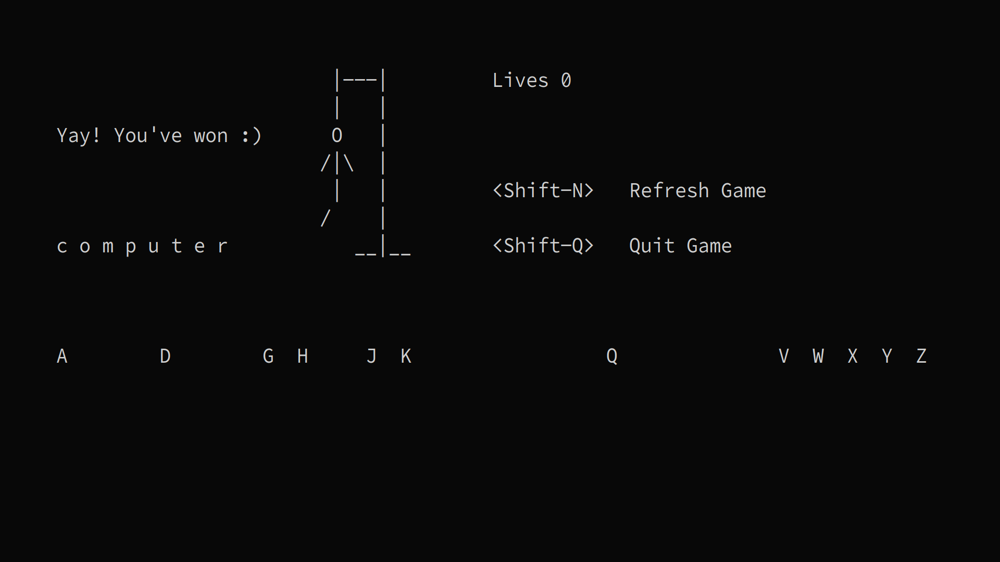

# Letter
Letter is a terminal implementation of the classic game Hangman written in Perl
using bindings for ncurses.

## Dependencies
Letter depends on Perl bindings for ncurses.

Ubuntu
```
sudo apt install libcurses-perl
```

Fedora
```
sudo dnf install perl-Curses
```

Arch
```
sudo pacman -S perl-curses
```

## Instructions
Clone the repository and execute the file `letter.pl` to run the game.

Words are taken from `words.txt` which contains all words between 4 and 10
letters extracted from the standard Unix `words`. You can supply your own
wordlist by replacing the contents of `words.txt`.

## Screenshots




## License
GNU General Public License v3.0
