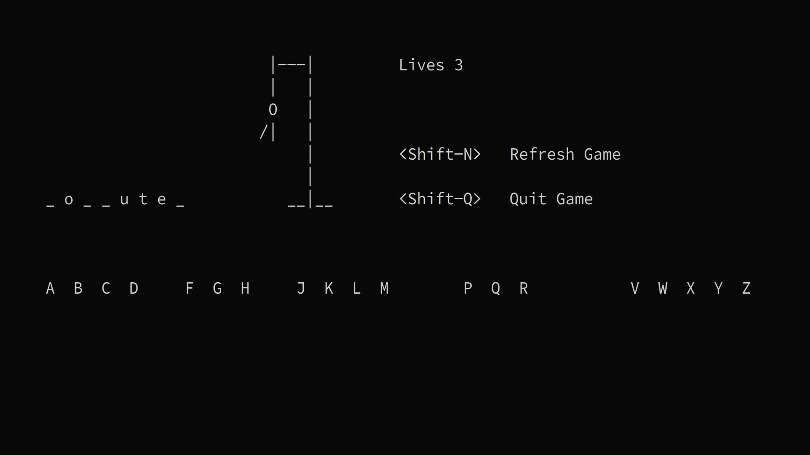

### Letter
Letter is an implementation of the popular game Hangman for the terminal. It is
written in Perl using bindings for ncurses.

## Dependencies
Letter depends on Perl bindings for ncurses. Here are the commands to install
Perl bindings for popular Linux distributions.

Ubuntu
```
sudo apt install libcurses-perl
```

Fedora
```
sudo dnf install perl-Curses
```

Arch
```
sudo pacman -S perl-curses
```

## Instructions
Clone the repository and execute the file `letter.pl` to run the game.

Words are taken from `words.txt` which contains all words between 4 and 10
letters extracted from the standard Unix `words`. You can supply your own
wordlist by replacing the contents of `words.txt`.

## Screenshot



## License
GNU General Public License v3.0
